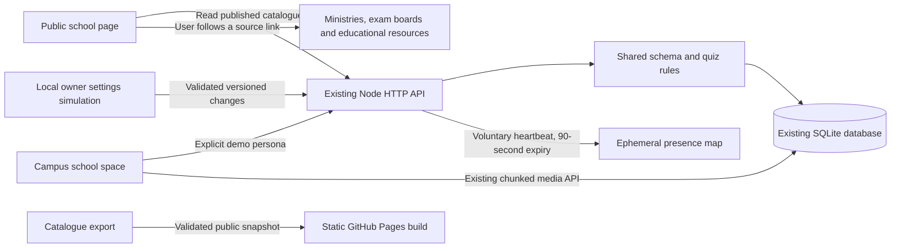

# LESSGOOO application architecture

Last reviewed: 2026-09-24. See [README](README.md#architecture-and-service-count)
for diagrams, dependencies and connection details.

| Surface | Runtime | Data | Deployment |
|---|---|---|---|
| Public website | React/TypeScript/Vite static files | Approved public content | GitHub Pages, ADR-001 |
| Campus demo | One Node HTTP process, React assets and API | Embedded SQLite and attachment chunks | Local process/Compose, ADR-003 |
| Teaching lab | Same campus container, one replica | Persistent SQLite volume | Private Kubernetes, ADR-004 |

The campus is a modular monolith: HTTP, domain rules, storage, studio workers and
integration adapters share one deployable runtime. There are **zero independent
business microservices and one application service**. SQLite is an embedded
library, not a database server. Transcription is an optional Python child process
and is absent from the standard container.

UI components do not own domain rules. Institutional copy is governed by docs/.
The API filters demo personas, checks local Host/Origin, and uses transactions
and optimistic versions. A persona selector is not authentication.

Traefik, Argo CD and observability are infrastructure, not business microservices.
Lab traffic enters through localhost port-forward. No public application load
balancer, DNS name or production identity system is provisioned.

Permanent backend/authentication selection remains
[SECURITY-001](docs/UNKNOWN.md). Containerization does not resolve authentication,
privacy, recovery or availability requirements. Do not scale SQLite to multiple
writers.

## School-support module

The school module adds no deployable service or new dependency. Its shared
schema, original revision catalogue, quiz scoring and explainable guidance live
in `src/school/`. The existing Node process exposes `/api/school/*` through
`server/school-store.ts`. SQLite adds `school_catalog`, `school_profiles` and
`school_attempts`; existing media tables store authorised attachments.

Anonymous catalogue responses and static snapshots omit local media, meeting
links and unpublished content. Private routes require an explicit validated
demo persona header; this is still not authentication. Only the owner-settings
simulation can edit the catalogue. Parent views read the linked fictional child
and cannot write that child's marks or attempts. A stale catalogue version
cannot overwrite settings or silently grade a quiz against changed questions.

Presence is in-memory only, deduplicated per demo profile, with no nominal peer
roster returned to learners. Guidance runs deterministically from self-reported
marks and interests and has no external AI dependency. Neither indicates real
attendance, a psychometric result or admission eligibility.

See the [operator guide](docs/product/school-support-guide.md) for limits,
export/import and the static publication command. ADR-001/003/004 remain in force.
