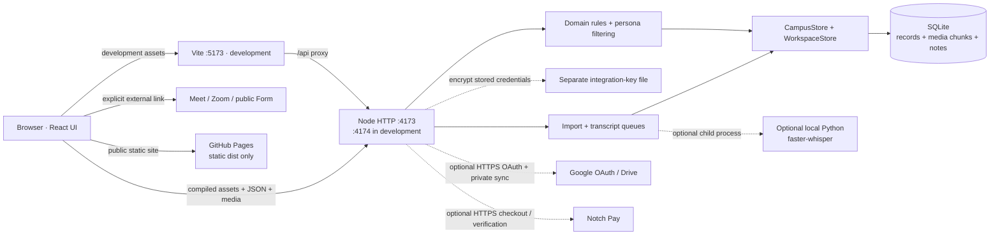
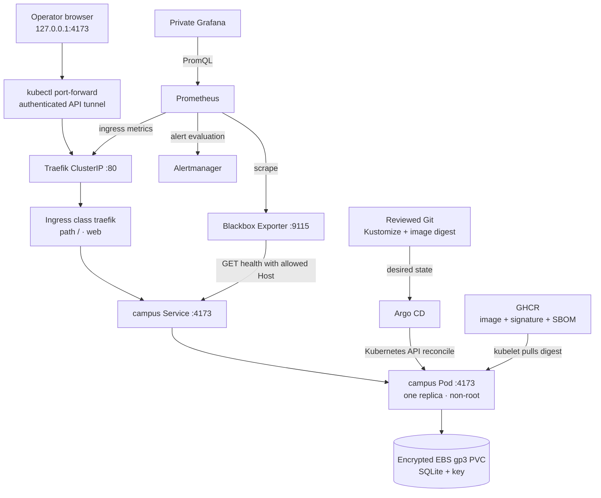
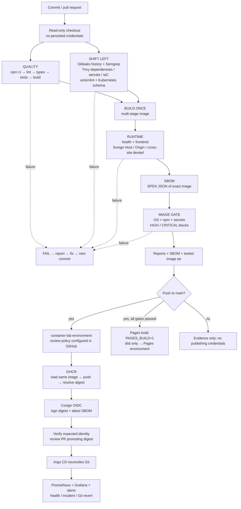

# LESSGOOO Campus · learn, build, secure, deploy

A bilingual React/TypeScript website and local campus demonstration, with a
hands-on DevSecOps project from source code to a **private Kubernetes lab**.

The campus includes lessons, homework, demo learner/parent/teacher views, media,
galleries, notebooks, career interests, live-class links, video imports, optional
local transcription and service enquiries. The public website remains on GitHub Pages.

> The campus uses fictional personas, not real login accounts. Keep it private
> and use synthetic data. Containers and Kubernetes do not add authentication.
> AWS EKS, nodes, disks, NAT and logs cost money. This is an optional teaching
> lab, not authorization to spend money or expose real learner data.

**Contents:** [setup](#run-locally) · [architecture](#architecture-and-service-count)
· [Compose](#docker-compose-step-by-step) · [security](#shift-left-security)
· [pipeline](#github-actions-pipeline) · [secrets](#secrets-and-supply-chain)
· [AWS](#aws-eks-in-a-few-commands) · [Kubernetes](#kubernetes-and-traefik)
· [Argo CD](#argocd-gitops) · [monitoring](#prometheus-and-grafana)
· [recovery](#recovery-cleanup-and-troubleshooting) · [student phases](#student-project-in-ten-phases).

## Scope and evidence

| State | Meaning |
|---|---|
| CONFIRMED | Owner requested this teaching project on 2026-09-18; see [scope](docs/product/devsecops-project.md). |
| INFERRED from code | Service counts and connections below describe the actual implementation. |
| Implemented artifacts | Docker, Compose, workflows, Kubernetes resources, Helm values, dashboard, alerts and GitOps definitions are in this repository. |
| Operator configuration | Supply a real verified image digest, repository access, Grafana secret and authorized AWS account/region/IP/budget. |
| UNKNOWN | Production identity, institutional data protection, permanent backend and commercial terms remain in [docs/UNKNOWN.md](docs/UNKNOWN.md). |

Checked-in manifests are not proof of a live deployment. Read
[validation status](docs/quality/devsecops-validation.md) for what was actually
executed. [ADR-004](docs/decisions/ADR-004-private-devsecops-lab.md) preserves
the public static site and local demo boundaries.

## Run locally

Install Git, **Node.js 22.23 or newer** with native SQLite, and npm. CI/container
use the Node 22 release line. Use the committed lockfile.

```sh
git clone https://github.com/LessGooo-26/lessgooo-platform.git
cd lessgooo-platform
# Until this work is merged, select the branch containing these files:
git switch codex/campus-local
npm ci
npm run dev
```

Open [development campus](http://127.0.0.1:5173/campus.html) or
[public site](http://127.0.0.1:5173/). Vite proxies /api to Node on 4174.
For the compiled runtime:

```sh
npm run lint
npm run typecheck
npm test
npm run build
npm start
```

Open [compiled campus](http://127.0.0.1:4173/campus.html) or
[compiled public site](http://127.0.0.1:4173/index.html).

| Actual package script | Purpose |
|---|---|
| npm run dev | Vite and Node development servers |
| npm run lint / npm run typecheck | ESLint / TypeScript checks |
| npm test | Vitest domain, storage, security and UI tests |
| npm run build | Typecheck, dist/ assets, dist-server/ Node bundle |
| npm start | Start compiled Node server |
| npm run backup | SQLite online backup including attachments and encryption key when present |
| npm run format | Existing campus/server/script/test formatter |

The npm commands work in PowerShell. Other examples below use **Bash on
Linux/macOS or WSL2**. Cloud phases require AWS CLI v2, eksctl, kubectl compatible
with Kubernetes 1.35, standalone kustomize, Helm, Git, curl, OpenSSL, Argo CD CLI and Cosign.
Install from official releases and verify downloads. Docker needs a running
Linux container engine; Docker Desktop licensing depends on your use.

## Architecture and service count

**1 deployable application service. 0 independent business microservices.**
The campus is a modular monolith. React has two frontend entry points; SQLite
is embedded; job workers share the Node runtime. Optional transcription launches
a local Python process. None is an independently deployed business service.

| Mode | Application services | Other runtime pieces |
|---|---:|---|
| Development | 1 API | Temporary Vite server, SQLite |
| Compiled / Docker Compose | 1 campus container | Persistent data volume |
| Kubernetes lab | 1 Deployment, 1 replica, 1 Service | Ingress, GitOps and observability |
| GitHub Pages | 0 app server processes | Hosted static files only |

The lab has **4 Helm releases**: monitoring, blackbox, traefik and argocd.
They supply **5 named infrastructure products**: Prometheus, Grafana, Blackbox
Exporter, Traefik and Argo CD. Monitoring also installs Prometheus Operator,
Alertmanager, kube-state-metrics and node-exporter. Argo CD includes controllers,
API/repository servers, Redis and supporting components. These are not campus
microservices. Pod counts depend on chart settings and node count:

```sh
kubectl get deploy,statefulset,daemonset,svc -A
helm list -A
```

### Current application and connections



| From → to | How | Why |
|---|---|---|
| Browser → Node | Loopback HTTP: HTML, JSON, streaming | Campus UI and data operations |
| Vite → Node | /api proxy | Same-origin development |
| HTTP → domain → store | In-process TypeScript calls | Central validation and persistence |
| Store → SQLite | node:sqlite, transactions | Records and attachment bytes in one backup boundary |
| Studio → storage/Python | Persistent queue / optional subprocess | Media import and offline transcription |
| Node → Google | Optional server HTTPS/OAuth, drive.file | Private copies of submitted/corrected work |
| Node → Notch Pay | Optional server HTTPS | Hosted checkout creation and actual payment verification |
| Browser → Meet/Zoom | User-clicked participant link | Conferencing occurs on provider site |
| Browser → public Google Form | User-clicked link | Enquiries stay in private Google responses; not imported into demo |
| Actions → Pages | Upload dist/ artifact | Publish only static frontend |

Host, Origin and cross-site checks restrict local access; they do not authenticate
a person. A user who can access this demo can switch persona. SQLite transactions
and optimistic versions protect writes. Attachments use 4 MiB upload chunks and
a 200 MiB per-file maximum.

### Code and dependency inventory

| Path | Responsibility |
|---|---|
| src/components, src/pages, src/content | Public interface/content |
| src/campus | Campus views, bilingual project UI |
| src/campus/lib | Models, domain rules, lessons, project data |
| server/http.ts | Routes, local Host/Origin checks |
| server/store.ts, server/workspace-store.ts | SQLite, state and attachment transactions |
| server/studio.ts, server/safe-download.ts | Import/transcription queues and SSRF controls |
| server/integrations.ts | Google/Notch Pay and encrypted settings |
| scripts | Dev, backup, validation and lab installation |
| deploy/k8s, deploy/eks | App manifests and AWS configuration |
| deploy/helm, deploy/argocd, deploy/monitoring | Platform values, GitOps, dashboard/alerts |
| security | Reviewed local SAST rules |
| docs | Institutional truth and engineering decisions |

There are **10 direct production npm dependencies**: React, React DOM,
React Router, Radix UI, Lucide React, Sonner, Zod, class-variance-authority,
clsx and tailwind-merge. Development tools include TypeScript, Vite, esbuild,
Tailwind, ESLint, Vitest and Testing Library. Exact direct/transitive versions
come from package-lock.json; the final image inventory comes from its SBOM.

```sh
npm ls --depth=0
mkdir -p .local-data
npm ls --all > .local-data/npm-dependency-tree.txt
```

Optional speech dependencies are pinned separately in
scripts/transcription-requirements.txt. External integrations use server HTTP
adapters. No Redis, PostgreSQL or cloud SDK is required by the application itself.

### Private Kubernetes traffic and control paths



The API tunnel is authenticated. HTTP remains internal to the private lab.
Traefik preserves localhost:4173 as Host. Public domains are rejected by the
existing server; headers are not rewritten to bypass this.

Use **one replica and Recreate updates**. SQLite is not a horizontally scaled
database; HPA/multiple writers are inappropriate. EBS volumes are AZ-bound and
updates can interrupt service. Public HTTPS needs a separate identity,
authorization, origin/cookie/OAuth, DNS and certificate design before exposure.

## Docker Compose step by step

1. Start Docker. Use Compose **2.24+** for the optional env-file syntax.
   Integrations are optional; no credentials are needed for the basic demo.

```sh
docker version
docker compose version
docker compose config --quiet
```

Avoid sharing unrestricted docker compose config output: it may expand secrets.
The build context excludes .env files, databases, backups and reports.

2. Build and start the existing compose.yaml:

```sh
docker compose build --pull
docker compose up -d --wait
docker compose ps
curl --fail http://127.0.0.1:4173/api/health
docker compose logs --tail=50 campus
```

Open [the campus](http://127.0.0.1:4173/campus.html). Make a fictional notebook
entry, restart, and verify persistence:

```sh
docker compose restart campus
docker compose exec campus id
docker compose exec campus node -p 'process.env.CAMPUS_DATA_DIR'
```

3. Understand the container. The multi-stage Dockerfile installs from the
   lockfile and runs lint/typecheck/tests/build. Runtime has production
   dependencies, dist/, dist-server/ and backup/transcription scripts, but no
   Python/model. UID 1000 runs Node. Compose drops capabilities, disables
   privilege escalation, makes root read-only, supplies /tmp and mounts
   campus-data at /app/.local-data. Only 127.0.0.1:4173 is published.

4. Create a coherent backup with SQLite's online backup API:

```sh
docker compose exec campus node scripts/backup.mjs
mkdir -p backups
docker compose cp campus:/app/.local-data/backups/. ./backups/
```

The image sets CAMPUS_BACKUP_DIR to that writable data-volume path. Preserve
each SQLite file and its adjacent .key together, privately. Copying only the
main file of an open WAL database is not a coherent backup.

5. Stop without deleting data:

```sh
docker compose down
```

Do not add --volumes unless intentionally deleting the data.
For an isolated runtime security smoke test, first free port 4173:

```sh
docker build -t lessgooo-campus:ci .
bash scripts/container-smoke.sh lessgooo-campus:ci
```

This script removes only its own container and anonymous volume. It verifies
health/frontend and rejects foreign Host, Origin and cross-site requests.
Speech model/container options are in [studio operations](docs/engineering/campus-studio.md).
Never bake recordings, keys, models or a user database into the normal image.

## Shift-left security

Check changes before runtime deployment. The chosen tools are open-source CLIs
with no required paid SaaS subscription. GitHub quotas and AWS charges still
apply; free tools do not imply free infrastructure.

| Concern | Tool | Blocking result / evidence |
|---|---|---|
| Secrets | Gitleaks Git history + Trivy current source | Redacted reports; leaked secret stops CI |
| Quality | ESLint, TypeScript, Vitest | Any failing check blocks build |
| SAST | Semgrep CE local rules | Reject eval, shell execution and raw React HTML patterns |
| Dependencies | Trivy lockfile scan | HIGH/CRITICAL block, including unfixed findings |
| IaC / container configuration | Trivy + kubeconform | Dangerous configuration or invalid Kubernetes schema blocks |
| Workflow syntax | actionlint | Invalid workflow blocks |
| Runtime | Container smoke and existing API tests | Health plus negative access checks |
| SBOM | Trivy SPDX JSON | Inventory for the exact tested image |
| Final image | Trivy OS/npm/secret scan | HIGH/CRITICAL block publication |
| Supply chain | Pinned tool bytes, Cosign | Signed immutable image and SBOM attestation |
| Review/update | PR protection, Dependabot | Reviewed code and dependency changes |

The three Semgrep rules are a starting policy, not comprehensive taint analysis.
The HTTP checks are security smoke tests, not full DAST or a penetration test.
Expand reviewed rules/authorized DAST as an advanced phase. A scanner failure or
unavailable vulnerability database fails the job; no continue-on-error bypass
is configured.

Linux x86_64 with Docker and kubectl can run the same source checks:

```sh
bash scripts/install-security-tools.sh
bash scripts/security-checks.sh
```

[deploy/tool-versions.env](deploy/tool-versions.env) pins releases, checksums and
the Semgrep image digest. Binary checksums are verified before extraction.
Review advisories when updating, including
[Trivy's supply-chain advisory](https://github.com/aquasecurity/trivy/security/advisories/GHSA-69fq-xp46-6x23).
No remote install script is piped into a shell.

Exercise: on a disposable branch, add a harmless eval expression rejected by
the SAST rule, observe CI failure, then fix it. Never use a real credential as a
test. If a real secret leaks, revoke/rotate it first; removing the line does not
remove Git history.

## GitHub Actions pipeline

[ci.yml](.github/workflows/ci.yml) runs on PRs and main/codex branch pushes.
Only a **push to main** publishes; manual runs validate only.



| Job / stage | Output | Authority |
|---|---|---|
| quality | Validated source build | contents:read |
| security | Secret/SAST/SCA/IaC reports | No release secrets |
| image | Tested image tar, scan, SBOM | No registry write token |
| publish | GHCR digest, signature, SBOM attestation | main push + environment; packages:write, id-token:write |
| pages | Static dist artifact/site | Waits for quality, security AND image |
| promotion | Reviewed digest change in Git | Operator/reviewer; CI has no kubeconfig |
| reconciliation | Running app matching Git | Restricted Argo AppProject |
| operation | Alerts, diagnosis and recovery | Separate operator access |

The publication job loads the tested bytes; it does not rebuild. A sha tag
helps discovery, but the deployment pins sha256. Reports/SBOM have bounded
retention. An SBOM is an inventory, not proof that software is safe.

### Configure GitHub

1. Enable Actions and set Pages source to **GitHub Actions**.
2. Protect main with PR review and required DevSecOps quality/security/image
   checks; restrict direct pushes and protect workflow/deployment changes.
3. Create **container-lab**, restrict to main, and configure required reviewers
   if your plan supports them. A YAML environment name alone does not enable
   manual approval. Otherwise use protected main and authorized merges.
4. Configure the **github-pages** environment policy. The reusable Pages
   workflow now waits for security and container gates too.
5. Permit the job's GITHUB_TOKEN to publish the repo's GHCR package. No
   long-lived write PAT or AWS access key is needed.
6. Run a PR in an authorized branch/fork and inspect all reports before merging.
   Untrusted fork PRs receive no publication secrets.

Pages intentionally fails closed on security failures. Fix findings instead of
removing gates. A justified exception must be narrow, reviewed, owned and dated.

## Secrets and supply chain

| Value | Storage | Consumer / rotation |
|---|---|---|
| GITHUB_TOKEN | Ephemeral GitHub job token | GHCR publishing; expires automatically |
| Cosign OIDC | Per-run GitHub identity | Keyless signing bound to workflow/ref |
| AWS credentials | Local AWS SSO session | Operator's eksctl/kubectl; no committed access keys |
| Google / Notch Pay settings | Ignored .env.local; optional runtime Secret for an approved integration exercise | Server only; revoke/replace at provider |
| Integration encryption key | Persistent data volume + private backup | AES-GCM; losing it makes stored credentials unreadable |
| Grafana password | grafana-admin Kubernetes Secret | Grafana; rotate with supported Grafana procedure |
| Private Git credentials | Argo CD repository Secret | Read-only GitHub App/deploy key/token |
| Private GHCR pull token | Namespace imagePullSecret | read:packages; separate from publish authority |

Never put secrets in VITE_* variables: Vite embeds them in browser JavaScript.
Never put them in Docker build arguments, Dockerfile ENV, workflow source,
screenshots or reports. Base64 Secret YAML is not encryption. Use Kubernetes
RBAC and verify at-rest encryption settings. A production external secret
provider/workload identity needs a separate design; it is not installed here.

Optional local integrations start from [.env.example](.env.example); do not
overwrite an existing .env.local. Google requires Drive API and a Web OAuth
client with callback http://127.0.0.1:4173/api/integrations/google/callback (4174
in development). Only the documented integration account is accepted. Notch Pay
mode must match its key; a checkout link is not proof of payment.
See [local operations](docs/engineering/local-campus.md).

Campus egress in Kubernetes is DNS-only. Google, payments and remote imports
are intentionally unavailable there. Do not copy real workstation credentials
or records into student clusters.

### Verify the image before promotion

Use the real digest from a successful main publication summary:

```sh
export IMAGE='ghcr.io/lessgooo-26/lessgooo-platform@sha256:REPLACE_WITH_64_HEX_DIGEST'
export IDENTITY='https://github.com/LessGooo-26/lessgooo-platform/.github/workflows/ci.yml@refs/heads/main'
cosign verify "$IMAGE" --certificate-identity "$IDENTITY" --certificate-oidc-issuer https://token.actions.githubusercontent.com
cosign verify-attestation "$IMAGE" --type spdxjson --certificate-identity "$IDENTITY" --certificate-oidc-issuer https://token.actions.githubusercontent.com
```

For a fork, change owner/repo in both. Do not skip identity/issuer verification.
Private packages require read-only registry authentication via stdin. Argo CD
does **not** enforce signatures automatically: reviewed promotion is the
enforcement point. Admission-time signature policy is an advanced extension,
not an installed feature. [Cosign reference](https://docs.sigstore.dev/cosign/signing/signing_with_containers/).

## AWS EKS in a few commands

[deploy/eks/cluster.yaml](deploy/eks/cluster.yaml) defines Kubernetes 1.35,
eu-west-1, two private t3.large managed nodes, one NAT gateway, selected control
plane logs, VPC CNI network policy enforcement and EBS CSI with its service IAM
role. Application Pods receive no AWS credentials.

Before creation: choose an authorized sandbox account, estimate current regional
charges, set a budget alert, agree an end time and assign a cleanup owner.
Budget alerts are notifications, not spending caps. EKS, EC2, disks, IP/NAT and
CloudWatch can each incur charges. Account, region, quotas and IAM permissions
are operator choices, not institutional facts.

1. Authenticate with SSO and verify the account/version:

```sh
aws configure sso --profile lessgooo-lab
aws sso login --profile lessgooo-lab
export AWS_PROFILE=lessgooo-lab
export AWS_REGION=eu-west-1
aws sts get-caller-identity
aws eks describe-cluster-versions --cluster-versions 1.35 --region "$AWS_REGION"
```

2. Edit cluster.yaml. Replace the **192.0.2.1/32 documentation placeholder**
with your current public IPv4/32; retain private API access for workers.
Keep region settings consistent. Review before provisioning:

```sh
eksctl create cluster -f deploy/eks/cluster.yaml --dry-run
# This next command creates chargeable AWS resources.
eksctl create cluster -f deploy/eks/cluster.yaml
aws eks update-kubeconfig --name lessgooo-lab --region "$AWS_REGION" --alias lessgooo-lab
kubectl get nodes
eksctl get addons --cluster lessgooo-lab --region "$AWS_REGION"
```

Creation takes time. Update the API /32 if your network changes. A private-only
API would need a VPN/bastion or approved connectivity path, not supplied here.
Check [EKS versions](https://docs.aws.amazon.com/eks/latest/userguide/kubernetes-versions.html)
and [eksctl add-ons](https://docs.aws.amazon.com/eks/latest/eksctl/addons.html).

3. Prepare Grafana's password outside Git/history. Do this once for a new lab;
do not silently regenerate an existing installation's password:

```sh
umask 077
mkdir -p .local-data/lab-secrets
printf 'admin' > .local-data/lab-secrets/grafana-user
openssl rand -base64 32 > .local-data/lab-secrets/grafana-password
kubectl create namespace monitoring --dry-run=client -o yaml | kubectl apply -f -
kubectl -n monitoring create secret generic grafana-admin --from-file=admin-user=.local-data/lab-secrets/grafana-user --from-file=admin-password=.local-data/lab-secrets/grafana-password --dry-run=client -o yaml | kubectl apply -f -
```

Read the generated password privately for login; never paste it in a report.

4. Install the platform in the dedicated context:

```sh
bash scripts/install-lab-platform.sh
helm list -A
kubectl get pods -n monitoring
kubectl get pods -n traefik
kubectl get pods -n argocd
```

Read [the script](scripts/install-lab-platform.sh) first. It checks the context,
creates encrypted gp3 storage, installs monitoring CRDs before Traefik's
ServiceMonitor, and installs four pinned Helm releases plus alerts/dashboard.
The values files provide all custom configuration; upstream charts generate
their Kubernetes resources.

To inspect those resources offline, after adding the chart repositories:

```sh
source deploy/tool-versions.env
mkdir -p .local-data/rendered
helm template monitoring prometheus-community/kube-prometheus-stack --version "$MONITORING_CHART_VERSION" --namespace monitoring -f deploy/helm/monitoring-values.yaml > .local-data/rendered/monitoring.yaml
helm template traefik traefik/traefik --version "$TRAEFIK_CHART_VERSION" --namespace traefik --api-versions monitoring.coreos.com/v1 -f deploy/helm/traefik-values.yaml > .local-data/rendered/traefik.yaml
helm template argocd argo/argo-cd --version "$ARGOCD_CHART_VERSION" --namespace argocd -f deploy/helm/argocd-values.yaml > .local-data/rendered/argocd.yaml
helm template blackbox prometheus-community/prometheus-blackbox-exporter --version "$BLACKBOX_CHART_VERSION" --namespace monitoring -f deploy/helm/blackbox-values.yaml > .local-data/rendered/blackbox.yaml
```

Chart versions were checked 2026-09-18. Review supported Kubernetes versions,
release notes and advisories when updating.

## Kubernetes and Traefik

### Application manifest inventory

| File under deploy/ | Object | Purpose |
|---|---|---|
| k8s/base/namespace.yaml | Namespace | Isolation and restricted Pod Security admission |
| k8s/base/serviceaccount.yaml | ServiceAccount | App has no mounted Kubernetes API token |
| k8s/base/configmap.yaml | ConfigMap | Non-secret runtime configuration |
| k8s/base/pvc.yaml | PVC | 10 GiB ReadWriteOnce data; protected against Argo prune/delete |
| k8s/base/deployment.yaml | Deployment | One non-root replica, Recreate, probes, limits, read-only root |
| k8s/base/service.yaml | ClusterIP Service | Stable internal port 4173 |
| k8s/base/ingress.yaml | Ingress | Traefik web route / to campus |
| k8s/base/networkpolicy.yaml | NetworkPolicy | Ingress from Traefik/monitoring, DNS-only egress |
| k8s/base/kustomization.yaml | Kustomize base | Assemble resources |
| k8s/overlays/eks/kustomization.yaml | Overlay | EKS storage class and reviewed image |
| eks/storageclass.yaml | StorageClass | Encrypted gp3, delayed AZ binding, Retain |
| argocd/project.yaml, application.yaml | Argo resources | Constrained GitOps reconciliation |
| monitoring/alerts.yaml, dashboard.yaml | PrometheusRule, ConfigMap | Lab alerts and Grafana dashboard |

The optional campus-integrations Secret is absent from Git. It is not required.
NetworkPolicy needs an enforcing CNI: the EKS configuration enables VPC CNI
network policies. Verify actual enforcement rather than assuming YAML alone
is proof.

The image placeholder intentionally fails until configured. After signature
verification, set the immutable digest:

```sh
# IMAGE is the verified digest from the earlier phase.
(cd deploy/k8s/overlays/eks && kustomize edit set image "lessgooo-campus=$IMAGE")
kubectl kustomize deploy/k8s/overlays/eks
kubectl apply --dry-run=server -k deploy/k8s/overlays/eks
```

Standalone kustomize is needed for edit; kubectl has rendering built in.
A first manual exercise can apply the resources before handing ownership to
Argo CD:

```sh
kubectl apply -k deploy/k8s/overlays/eks
kubectl -n campus-lab rollout status deployment/campus --timeout=180s
kubectl -n campus-lab get pods,svc,ingress,pvc
kubectl -n campus-lab logs deployment/campus --tail=50
kubectl -n traefik port-forward --address 127.0.0.1 service/traefik 4173:80
```

Keep the final command running; stop any local campus occupying 4173 first.
Open [the private lab](http://127.0.0.1:4173/campus.html). Port 4173 is intentional
because the server's Host/Origin checks use it. In another terminal:

```sh
curl --fail http://127.0.0.1:4173/api/health
curl -s -o /dev/null -w '%{http_code}\n' -H 'Host: attacker.invalid' http://127.0.0.1:4173/api/health
curl -s -o /dev/null -w '%{http_code}\n' -H 'Origin: https://attacker.invalid' http://127.0.0.1:4173/api/health
```

Expect health 200, then 403 twice. Kubernetes probes explicitly send
Host: 127.0.0.1:4173. No public load balancer is created. Do not change the service
to LoadBalancer to bypass the app's private-demo boundary.

### Private package pulls

If GHCR is private, create a read-only image pull secret before synchronization.
Use a clean Docker config dedicated to this credential, not a file containing
other registry logins:

```sh
mkdir -p .local-data/ghcr-read
read -r -p 'GitHub username: ' GH_USER
read -r -s -p 'Read-only package token: ' GH_READ_TOKEN
printf '\n'
printf '%s' "$GH_READ_TOKEN" | docker --config .local-data/ghcr-read login ghcr.io --username "$GH_USER" --password-stdin
unset GH_READ_TOKEN
kubectl apply -f deploy/k8s/base/namespace.yaml
kubectl -n campus-lab create secret generic ghcr-read --type=kubernetes.io/dockerconfigjson --from-file=.dockerconfigjson=.local-data/ghcr-read/config.json
```

Add a Kustomize patch targeting Deployment/campus with:

```yaml
spec:
  template:
    spec:
      imagePullSecrets:
        - name: ghcr-read
```

If the owner authorizes a public package this is unnecessary. Do not make a
private package public merely to work around missing pull credentials.

## ArgoCD GitOps

CI publishes artifacts but has no cluster credentials. Argo CD pulls desired
state from Git and reconciles through the Kubernetes API.

1. Push this work and the verified digest change to the authorized remote
   branch. The example watches main; change targetRevision for a lab branch.
   For a fork, update repoURL in both Application and AppProject allowlist.
2. For private Git, configure a read-only repository credential through Argo CD's
   UI or documented repository Secret. Do not commit it. AppProject is an
   authorization boundary, not a repository credential.
3. Access Argo CD privately:

```sh
kubectl -n argocd port-forward --address 127.0.0.1 service/argocd-server 8080:443
```

Open [Argo CD](https://127.0.0.1:8080); its bootstrap certificate is self-signed.
Retrieve the initial admin password privately, sign in, and change it. These
commands are for your private operator terminal; never include their output in
a report. The CLI prompts for credentials and certificate confirmation.

```sh
argocd admin initial-password -n argocd
argocd login 127.0.0.1:8080 --username admin
argocd account update-password
```

4. After the watched Git revision contains the real digest:

```sh
kubectl apply -f deploy/argocd/project.yaml
kubectl apply -f deploy/argocd/application.yaml
kubectl -n argocd get application campus-lab
kubectl -n campus-lab rollout status deployment/campus --timeout=180s
kubectl -n campus-lab get pods -o jsonpath='{range .items[*]}{.metadata.name}{" "}{.status.containerStatuses[0].imageID}{"\n"}{end}'
```

Expect **Synced / Healthy** and the intended digest. Self-heal is enabled;
automatic pruning is off and the PVC is protected. Removed/renamed objects need
deliberate cleanup rather than automatic data deletion.

Promote by verifying the new signature/SBOM, changing the overlay digest,
reviewing/merging a PR and checking the running image/health. Roll back with a
reviewed **Git revert** of the promotion. kubectl rollout undo is not a lasting
rollback because Argo self-heal reapplies Git. A code rollback is not a database
rollback: check schema compatibility and take a coherent backup before upgrades.

The AppProject limits repository, destination and resource types; bootstrap
operator authority is separate. See [Argo CD setup](https://argo-cd.readthedocs.io/en/stable/getting_started/)
and [declarative configuration](https://argo-cd.readthedocs.io/en/stable/operator-manual/declarative-setup/).

## Prometheus and Grafana

Prometheus collects cluster/ingress metrics and scrapes Blackbox Exporter.
The exporter calls /api/health with the allowed Host, including a real SQLite
read. Grafana queries Prometheus. The application has **no native /metrics
endpoint**; business/per-route metrics are not invented.

| Signal | PromQL | Meaning |
|---|---|---|
| Health | probe_success{job="campus-health"} | 1 = successful probe; missing is not healthy |
| HTTP duration | probe_duration_seconds{job="campus-health"} | Whole health probe, not each application route |
| Restarts | sum(increase(kube_pod_container_status_restarts_total{namespace="campus-lab",container="campus"}[15m])) | App restarts in 15 minutes |
| Memory | sum(container_memory_working_set_bytes{namespace="campus-lab",container="campus"}) | App working-set memory |
| Ingress errors | sum(rate(traefik_service_requests_total{code=~"5.."}[5m])) | Traefik service errors/sec; no series may mean no traffic |

The supplied **LESSGOOO · private lab** Grafana dashboard contains these five
panels. Kube-prometheus-stack includes additional cluster dashboards.
CampusUnavailable fires after two minutes of failed/missing probes;
CampusRestarting detects repeated restarts.

Alertmanager is installed, but external email/Slack/webhook receivers are
**not configured**. Inspect alerts locally. Configure an authorized receiver and
test delivery before claiming notifications work.

Run these in separate terminals:

```sh
kubectl -n monitoring port-forward --address 127.0.0.1 service/monitoring-grafana 3000:80
kubectl -n monitoring port-forward --address 127.0.0.1 service/monitoring-kube-prometheus-prometheus 9090:9090
kubectl -n monitoring port-forward --address 127.0.0.1 service/monitoring-kube-prometheus-alertmanager 9093:9093
```

Open [Grafana](http://127.0.0.1:3000), [Prometheus](http://127.0.0.1:9090) and
[Alertmanager](http://127.0.0.1:9093). Use your privately generated Grafana
password. Inspect Targets, query probe_success and review alert state.

Prometheus retains three days, capped at 7 GB on a 10 GiB volume; Grafana has
2 GiB persistence. These are lab sizes, not production recommendations.
Dashboards/APIs remain private because metrics disclose infrastructure.

Exercise an outage only in an isolated lab. With Argo self-heal, commit a
temporary replicas: 0 change on the dedicated lab branch, observe the alert,
then revert to 1. Record detection/recovery times. Do not claim an SLO from one
experiment or test a production outage.

References: [Prometheus Community charts](https://prometheus-community.github.io/helm-charts/)
and [Traefik Kubernetes setup](https://doc.traefik.io/traefik/setup/kubernetes/).

## Recovery, cleanup and troubleshooting

### Coherent backup and isolated restore

Native npm run backup writes to backups/ unless CAMPUS_BACKUP_DIR is set.
The image sets it to /app/.local-data/backups on the writable volume.
Kubernetes backup:

```sh
kubectl -n campus-lab exec deployment/campus -- node scripts/backup.mjs
POD="$(kubectl -n campus-lab get pod -l app.kubernetes.io/name=campus -o jsonpath='{.items[0].metadata.name}')"
mkdir -p backups/kubernetes
kubectl -n campus-lab cp "$POD:/app/.local-data/backups/." backups/kubernetes/
```

Store backups outside the cluster in a private location. Preserve the .key with
its SQLite backup; restore environment secrets separately. A snapshot on the
same storage system is not an independent recovery plan.

Restore into a **new** data directory, never over a running/original database.
Select actual filenames, stop any other server on port 4173, then:

```sh
mkdir .local-data/restore-exercise
cp backups/SELECTED.sqlite .local-data/restore-exercise/campus.sqlite
# Only if the selected backup includes an encryption key:
cp backups/SELECTED.sqlite.key .local-data/restore-exercise/integration-key
CAMPUS_DATA_DIR=.local-data/restore-exercise npm start
```

Verify a fictional note and attachment bytes. For Compose, use a new named
volume, copy the same files with UID/GID 1000 ownership and start the image
against it. Preserve campus-data. Record measured recovery time/data loss;
no production RTO/RPO is promised.


For a container restore with a **new named volume**, use the already built
lessgooo-campus:ci image and stop any server occupying 4173 first:

```sh
RESTORE_VOLUME="campus-restore-$(date +%Y%m%d%H%M%S)"
RESTORE_HELPER="$RESTORE_VOLUME-copy"
docker volume create "$RESTORE_VOLUME"
docker create --name "$RESTORE_HELPER" --user 0 -v "$RESTORE_VOLUME:/restore" lessgooo-campus:ci sh -c 'chown -R 1000:1000 /restore && chmod 700 /restore'
docker cp backups/SELECTED.sqlite "$RESTORE_HELPER:/restore/campus.sqlite"
# Only when the matching key file exists:
docker cp backups/SELECTED.sqlite.key "$RESTORE_HELPER:/restore/integration-key"
docker start -a "$RESTORE_HELPER"
docker rm "$RESTORE_HELPER"
docker run -d --name "$RESTORE_VOLUME" --read-only --tmpfs /tmp --cap-drop ALL --security-opt no-new-privileges:true -p 127.0.0.1:4173:4173 -v "$RESTORE_VOLUME:/app/.local-data" lessgooo-campus:ci
curl --fail http://127.0.0.1:4173/api/health
```

Wait for the container healthcheck if the first request races startup.
Check the fictional note and attachment. The temporary root helper only fixes
ownership inside the newly created restore volume; the application remains
non-root. Stop/remove that test container when finished, preserving its named
volume until the restore evidence has been reviewed.

### Troubleshooting

| Symptom | Inspect |
|---|---|
| 403 via Traefik | Use 127.0.0.1:4173; preserve Host; no invented domain |
| Pod not ready | Probe Host, container logs, PVC and filesystem permissions |
| Pending PVC | EBS CSI/role, storage class, node AZ, scheduling/storage quota |
| ImagePullBackOff | Real digest, architecture, GHCR visibility/pull credential |
| SQLite locking | Exactly one replica; Recreate strategy |
| Data permission denied | UID/GID 1000, fsGroup, writable PVC; keep root read-only |
| Ingress 502/503 | Service labels, EndpointSlice, readiness and NetworkPolicy |
| Missing metrics | Blackbox target/Host/DNS, scrape configuration; app has no /metrics |
| Empty Grafana panels | Datasource, target health, dashboard sidecar and time range |
| Argo OutOfSync | Branch, repository access, digest commit, AppProject |
| Import/Drive/payment fails on EKS | External egress is blocked in this lab |
| Security gate failure | Read report and fix; do not remove the gate |
| EKS API timeout | SSO session, region/context and current IPv4 /32 |

```sh
kubectl config current-context
kubectl -n campus-lab describe pod -l app.kubernetes.io/name=campus
kubectl -n campus-lab get endpointslice
kubectl -n campus-lab get events --sort-by=.lastTimestamp
kubectl -n campus-lab logs deployment/campus --previous --tail=100
kubectl -n traefik logs deployment/traefik --tail=100
```

Redact shared output; never include secret values.

### Cleanup

Export needed evidence/backups first. Stop tunnels. Record PVC/PV IDs and AWS
resource tags. The authorized operator should run teardown only after confirming
that the dedicated lab can be deleted:

```sh
kubectl get pvc -A
kubectl get pv
# Destructive: deletes this lab's nodes/control plane.
eksctl delete cluster -f deploy/eks/cluster.yaml --wait
aws eks list-clusters --region "$AWS_REGION"
```

Retain storage means cluster deletion does **not** guarantee EBS disks/snapshots
or CloudWatch logs are gone. Review named/tagged lab disks, snapshots, logs,
NAT/network resources, IP allocations and CloudFormation stacks; delete only
confirmed disposable resources and check billing afterwards. Avoid broad
account-wide deletion. Closing a terminal does not stop AWS charges.

## Student project in ten phases

In the campus, open **Projects & resources**, then the featured **Take LESSGOOO
from code to a cloud lab** project. Search Docker, AWS, Traefik or Argo CD.
Each phase provides a goal, tasks, evidence, an acceptance check and the matching
README chapter. English and French are available. The offline download is bundled
with the app; GitHub guide links show the new chapters after this branch is pushed.

| Phase | Work | Evidence / exit check |
|---|---|---|
| 01 Architecture | Run locally, trace requests, threat model | Correct topology/service count and demo limits |
| 02 Containers | Compose, data persistence, restore | Healthy non-root runtime; note survives replacement |
| 03 Shift left | Secrets/SAST/SCA/IaC/workflows | Harmless failing exercise followed by fix/passing gates |
| 04 CI and SBOM | Build once, scan, inventory | Commit → tested tar → SBOM traceability |
| 05 Secrets/signing | Protected publish, OIDC, verification | Verified signature/SBOM and rotation table |
| 06 AWS | Budget, SSO, IP allowlist, EKS | Approved budget/Ready nodes or offline plan |
| 07 Kubernetes | Manifests, storage, policies, Traefik | Health 200, foreign Host/Origin 403 |
| 08 GitOps | Argo, reviewed promotion, drift/rollback | Healthy/Synced and Git history |
| 09 Monitoring | Dashboards, PromQL, isolated outage | Alert/recovery timeline and dashboard export |
| 10 Recovery | Restore, cleanup, presentation | Verified data, resource inventory, five-minute demo |

Keep redacted evidence in the notebook or an authorized repository and request
instructor review. Opening a phase does not grant a grade/certificate or mark
completion. Cloud work is optional: an offline design with rendered manifests
can be submitted without purchasing resources.

Advanced architecture exercise: propose extracting media processing or
integration delivery into services with explicit APIs, ownership, queues,
identity and storage. Label that diagram **proposed**. It changes failure modes
and service counts; it is not the implemented architecture.

## Sources and limits

Repository authority: [knowledge index](docs/index.md),
[program scope](docs/programs/devops-cloud-ai.md),
[local demo ADR](docs/decisions/ADR-003-local-campus-demo.md),
[lab ADR](docs/decisions/ADR-004-private-devsecops-lab.md),
[project scope](docs/product/devsecops-project.md),
[permissions](docs/users/permissions-matrix.md) and [unknowns](docs/UNKNOWN.md).

Primary references checked 2026-09-18:

- [GitHub Actions secure use](https://docs.github.com/en/actions/reference/security/secure-use)
- [Trivy](https://trivy.dev/docs/latest/) and [official releases](https://github.com/aquasecurity/trivy/releases)
- [Semgrep CE](https://semgrep.dev/docs/semgrep-ce/overview) and [Gitleaks](https://github.com/gitleaks/gitleaks)
- [Cosign signing](https://docs.sigstore.dev/cosign/signing/signing_with_containers/)
- [eksctl cluster configuration](https://docs.aws.amazon.com/eks/latest/eksctl/creating-and-managing-clusters.html)
- [Kubernetes Deployments](https://kubernetes.io/docs/concepts/workloads/controllers/deployment/)
- [Traefik chart](https://github.com/traefik/traefik-helm-chart)
- [Argo CD chart](https://github.com/argoproj/argo-helm/tree/main/charts/argo-cd)
- [Monitoring chart](https://github.com/prometheus-community/helm-charts/tree/main/charts/kube-prometheus-stack)

The original [campus prototype](https://lessgooo-campus.amlate.chatgpt.site/) was
supplied on 2026-09-16. Its hosted database was not imported; the original logo
was retained. These changes do not modify that hosted site or assert production
readiness, accreditation, fees, schedules or employment guarantees.
